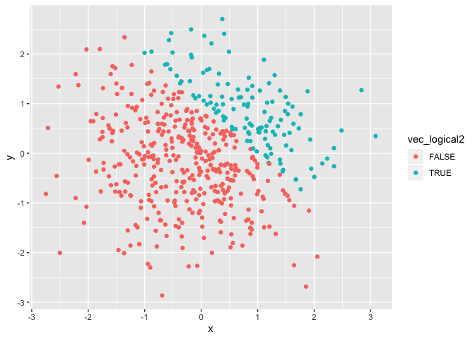
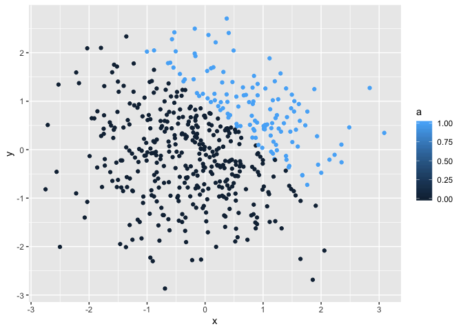
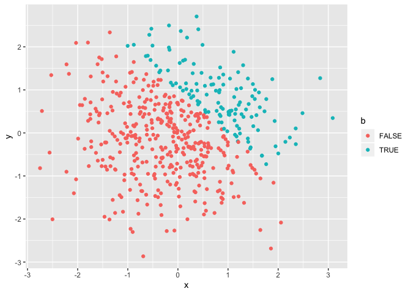

p8105\_hw1\_wz2506
================
Weiran Zhang
9/15/2019

\#\#Problem 1

``` r
library(tidyverse)
```

    ## ─ Attaching packages ──────────────────── tidyverse 1.2.1 ─

    ## ✔ ggplot2 3.2.1     ✔ purrr   0.3.2
    ## ✔ tibble  2.1.3     ✔ dplyr   0.8.3
    ## ✔ tidyr   0.8.3     ✔ stringr 1.4.0
    ## ✔ readr   1.3.1     ✔ forcats 0.4.0

    ## ─ Conflicts ────────────────────── tidyverse_conflicts() ─
    ## ✖ dplyr::filter() masks stats::filter()
    ## ✖ dplyr::lag()    masks stats::lag()

``` r
hw1_df = tibble(
  vec_numeric = rnorm(8),
  vec_char = c("My", "Name", "Is", "Weiran", "Zhang", "I", "Like", "DataScience"),
  vec_logical = vec_numeric > 0,
  vec_factor = factor(c("red", "green", "blue", "red", "blue", "blue", "green", "green"))
)

mean(pull(hw1_df, vec_numeric))
```

    ## [1] -0.05131271

``` r
mean(pull(hw1_df, vec_char))
```

    ## Warning in mean.default(pull(hw1_df, vec_char)): argument is not numeric or
    ## logical: returning NA

    ## [1] NA

``` r
mean(pull(hw1_df, vec_logical))
```

    ## [1] 0.375

``` r
mean(pull(hw1_df, vec_factor))
```

    ## Warning in mean.default(pull(hw1_df, vec_factor)): argument is not numeric
    ## or logical: returning NA

    ## [1] NA

\#\#The mean of numeric vector is a number, the mean of logical vector
is a number. The mean for the character vector and factor vector does
not work since they are neither numerical value nor logical value.

``` r
as.numeric(pull(hw1_df, vec_char))
as.numeric(pull(hw1_df, vec_logical))
as.numeric(pull(hw1_df, vec_factor))
```

\#\#The logical vector and the factor vector can be converted to
numerical forms. But the character vectot still cannot be changed to
numerical form. This results kind of help to explain the results when
taking the mean of those three vectors. Since the character vector are
composed of all different characters, so the character vector cannot be
converted to numeric
    form.

``` r
as.numeric(pull(hw1_df, vec_logical)) * pull(hw1_df, vec_numeric)
```

    ## [1] 0.0000000 0.7569048 0.0000000 0.0000000 0.0000000 0.6136071 0.0000000
    ## [8] 0.9947231

``` r
as.factor(pull(hw1_df, vec_logical)) * pull(hw1_df, vec_numeric)
```

    ## Warning in Ops.factor(as.factor(pull(hw1_df, vec_logical)), pull(hw1_df, :
    ## '*' not meaningful for factors

    ## [1] NA NA NA NA NA NA NA NA

``` r
as.numeric(as.factor(pull(hw1_df, vec_logical))) * pull(hw1_df, vec_numeric)
```

    ## [1] -0.09346121  1.51380955 -1.15163016 -0.25027107 -0.63271659  1.22721411
    ## [7] -0.64765754  1.98944613

\#\#Problem 2

``` r
library(tidyverse)
hw1_df2 = tibble(
  x = rnorm(500),
  y = rnorm(500),
  vec_logical2 = x + y > 1,
  a = as.numeric(vec_logical2),
  b = as.factor(vec_logical2)
)
```

`nrow <- nrow(hw1_df2); ncol <- ncol(hw1_df2); mean <- mean(hw1_df2$x);
median <- median(hw1_df2$x); sd <- sd(hw1_df2$x); proportion <-
length(hw1_df2$a[hw1_df2$a == 1]) / 500`

\#\#Plots

``` r
ggplot(hw1_df2, aes(x = x, y = y, color = vec_logical2)) + geom_point()
```

<!-- -->

``` r
ggplot(hw1_df2, aes(x = x, y = y, color = a)) + geom_point()
```

<!-- -->

``` r
ggplot(hw1_df2, aes(x = x, y = y, color = b)) + geom_point()
```

<!-- -->

\#\#Comment: In the plots of logical vector and factor vector, the blue
represents TRUE cases and red represents FALSE cases. In the plot of
numeric vector, The color from black to light blue represent number
ranges from 0 to 1. And 0 represents FALSE cases and 1 represents TRUE
cases. So according to those three plots, we can see there are more
FALSE cases than TRUE cases for “x + y \> 1” in this data frame.

## 

``` r
ggplot(hw1_df2, aes(x = x, y = y, color = vec_logical2)) + geom_point()
```

<!-- -->

``` r
ggsave("hw1_scatterplot.pdf", height = 4, width = 6)
```
